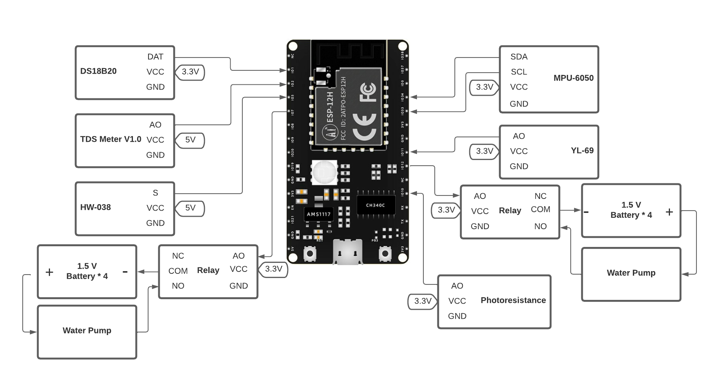
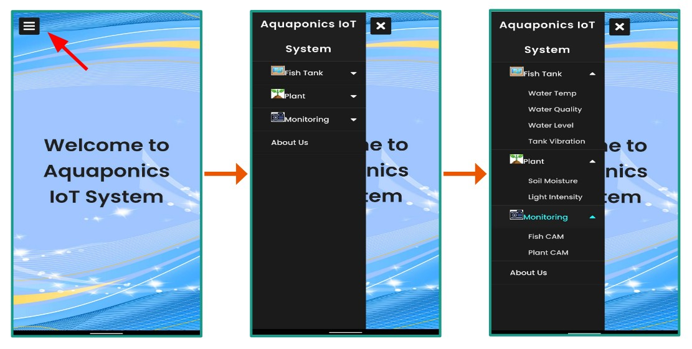

# Aquaponics-IoT-System

# Project Introduction
Nowadays, people's lifestyle are are getting busier and busier. Thus, having pets like a tank of fish becomes a great way to release the pressure from daily life. However, due to the busyness and the lack of time, people might lose patience in taking care of the fish tank. Hence, having an IoT system that could tell you the real-time data of your fish tank would be truly valuable. What could be better? In this project, we aim to build an aquaponics IoT system that can not only monitor the status of the fish tank but also use the collected data for further actions, such as reusing the tank water to irrigate the plants. 

# Table of Contents
* [Accomplishments](#accomplishments)
* [Bill of Materials](#bill-of-materials)
* [System Structure](#system-structure)
* [High Level Wiring Diagram](#high-level-wiring-diagram)
* [WebUI](#webui)
* [Mobile App](#mobile-app)
* [Demonstration](#demonstration)

# Accomplishments
* Automated the water-changing process and re-uses the water on plants based on the data/metrics collected
* Designed the sensing and controlling components that use ESP32 as MCU and connect ESP32 to nine different sensors to collect data and make corresponding decisions to achieve automation
* Enabled real-time monitoring by establishing the network between the sensing/controlling components and WebUI/App (in HTML, CSS, JavaScript, and Cordova) through the server created by ESP32

# Bill of Materials

| Components | Part # | Quantity |
| :-----------:  | :-----------: |:-----------: |
| Water Temparature Sensor| DS18B20 | 1 |
| Water Quality Sensor |TDS Meter V1.0|1|
| Water Lavel Sensor | HW-038 |1|
| Soil Moisture Sensor| YL-69 |1|
|Light Intensity Sensor|Photoresistance|1|
| Inertial measurement unit | MPU6050 |1|
| Water Pump (DC 3v ~ 5V) |---|2|
| Relay (DC 5V) | --- |3|
| UV Light (DC 5V) | --- |1|
| MCU | ESP32 |1|
| MCU | ESP32_CAM |1|

# System Structure

  

# High Level Wiring Diagram

  

# WebUI

  

# Mobile App

  

# Demonstration

